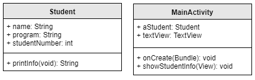

# Java Basics for Android
In this course, we will use the programming language Java to create our Android apps, so the first part of each week will focus on explaining Java concepts to you.  Additionally, these concepts will be related to actual "Android" code, showing you how these plain Java concepts are relevant all throughout your app! This will be done using written text and mini exercises.

## Table of contents
- [Concepts](#concepts)
    * [Classes](#classes)
    * [The constructor](#constructor)
    * [Parameters](#parameters)
    * [Return values](#return-values)
- [Practice](#practice)
	* [Getting started](#getting-started)
	* [Exercises](#exercises)
- [Plain Java vs. Android Studio](#java-vs-android)
    * [Classes](#android-classes)
    * [Parameters and return values](#android-params)

## Concepts

### Classes 
Java is a programming language that makes use of classes. A class is similar to a `struct` in C, but instead of just holding data, they can hold code that can be run as well. The data inside a Java class are commonly called *properties*, whereas the code that can be executed inside the class is called a *method*. Below is a very simple example of a Java class, which depicts a student.

        class Student {

            // Properties of the class
            private String name;
            private String program;
            private int studentNumber; 

            // Constructor of the class
            public Student(String aName, String aProgram, int aStudentNumber) {
                name = aName;
                program = aProgram;
                studentNumber = aStudentNumber;
            }

            // Method of the class
            public void printInfo() {
                System.out.println("This student is called " + name);
                System.out.println("they are studying " + program);
                System.out.println("and their student number is " + studentNumber);
            }
        }

As you can see this class does not just hold data (like the name, program and student number), it contains runnable code as well, in the form of the method `printInfo()`. When called, this method will print information about the student to the console.

### The constructor
An important part of the class is the *constructor*. It is a special method inside the class that we can call to create instances of that class. In Java, in order to use classes like the `Student` class, they need to be instantiated before they can be used. The `Student` class can be seen as a blueprint. It exists, but before we can use the properties or methods inside, we first need to create an *instance* of the class. The constructor is used to do so. 

Often the constructor is used to set the properties of the class to meaningful values, in this case we want to set the values of the name, the program the student is attending and the student number. The constructor of the class is made with this in mind, allowing us to insert these values. 

### Parameters
You can see in the method declaration of the constructor that it takes three parameters: two strings and an integer. 

         public Student(String aName, String aProgram, int aStudentNumber)

When creating a method in Java, this is the way in which you specify if and which values should be passed on to that method when it is called. The arguments that are passed will be accessible within the scope of the method to which they are passed. 

Suppose we wanted to create a new student object for the student Ada Lovelace and store it in the variable `al`:

        Student al = new Student("Ada Lovelace", "Computer Science", 61283);

Now, the variable `al` contains the values we initialized it with, because inside the constructor method, the values are stored in the properties of the student object. If we wanted to initialize another student as well, we can of course do so! 

        Student ik = new Student("Immanuel Kant", "Philosophy", 81148);

The variables `al` and `ik` can be seen as references to the respective objects. They each use the `Student` blueprint, but the contents of the properties are different.

### Return values
When taking a look at the printInfo() method, another aspect is important: the return type. Methods in Java specify the kind of value they return at the end. In this case, `printInfo()` is preceded by the word `void` which indicates that the method does not return any value. This is true, as it just prints anything but does not return a value to the caller. 

Suppose we had a different structure of the class in mind, which separates the tasks that are going on a bit more. Let's say we would want to split the task of building the string to be printed and the actual printing itself. Our methods could then look something like this:

        // Creates and returns a string with all info
        private String createInfoString() {
            String infoString = "This student is called " + name + 
                "they are studying " + program + " and their student number is " + studentNumber;
            return infoString;
        }

        // Prints the string info to the terminal
        public void printInfo() {
            String toPrint = createInfoString();
            System.out.println(toPrint);
        }

Now, all the `printInfo()` method does is call another method, `createInfoString()` and print the results from calling this method instead. This works because the `createInfoString()` method is defined to return a `String`. In Java, methods can return all kinds of variables and even instances of classes like `Student`! 

However, the kind of variable to be returned must be specified in the method declaration. We can clearly see this, as the declaration of `createInfoString()` is preceded by the keyword `String`. When a method does not return anything, like `printInfo()` we use `void`. An exception to this is the constructor: no return type keyword is used in its declaration. 

## Practice
You can try this out by grabbing the [following file](Java/StudentTest.java). It contains the code we have seen this far, though the strucure in which we present it in order to be able to run it is slightly different. 

Note that in regular Java, the point of entry of the program is the `main` method (just like we are used to in C!). The main method needs to be contained in a class as well, which we have called `StudentTest`. 

From this main method, we can access the `Student` class and create instances of it, as well as invoke the methods contained within the student class through the references we created before. Essentially, this is where the action happens most of the time. If you want to make changes to the contents of the `Student` class itself, this should of course be done inside that class instead!

### Getting started
To run Java programs, you need to have Java installed. You might already have it on your own computer, but if not, use the following instructions to be able to use Java online. If you already have a CS50 IDE, you can just create a new folder in your workspace and start there!

1. First, register for an account on edx.org, which will provide you with an account to log on to the CS50 IDE. If you already have an edX account, it’s no problem to use that one.

2. Now head to cs50.io and log on to the CS50 IDE. You may be prompted (again) for your email address. If so, after providing it, click Private under Hosted workspace, then click Create workspace.

3. You should then be informed that CS50 IDE (aka Cloud9, the software that underlies CS50 IDE) is “creating your workspace” and “creating your container,” which might take a moment. You should eventually see your workspace. If not, do just email your instructor to inquire!

To compile your Java file to a .class file, use this command on the terminal:

        javac YourJavaFileName.java

After compilation, you can run your program using:

        java YourJavaFileName

If you have trouble getting your Java programs to run in the IDE, run `update50`. If that does not work try:

        sudo apt-get update
        sudo apt-get install default-jdk

### Exercises 
1) Make calls to the method `printInfo()` so that the information of both students is printed to the terminal. 

2) Add a property that represents ECTS (studiepunten) to the student class, and make sure this property is correctly initialized when you create instances of the student object.

3) Create a method inside the student class, which both checks how many ECTS a certain student has and prints to the console whether they can ask for their diploma (which you need 180 for), or they still have to study some more!

4) Rewrite the method created at 3 so that instead of just printing everything directly, it makes a call to another method which handles the EC checking part and returns true or false, depending on whether the student is eligible for their diploma. 

Be sure to save your final file, as you will need to show us later.

## Plain Java vs. Android Studio
Most concepts in Java also apply to the way we write code in Android Studio, however they might take a slightly different shape. In this section we will review how the concepts of this week are used in Android Studio. This can help you understand the tools needed to build this week's app. 

###  Classes in Android Studio
In Android Studio, you will see classes as well, though the way in which they are used is slightly different. In your app, the different screens are represented by `Activities`. These activities are actually classes as well! 

However, instead of having a `main` method associated with them as in the example above, they make use of the method `onCreate` which is called when the respective activity is (surprise) created. Inside this method, the corresponding layout for the activity is set, after which you can start adding your own code.

        public class MainActivity extends AppCompatActivity {

            @Override
            protected void onCreate(Bundle savedInstanceState) {
                super.onCreate(savedInstanceState);
                setContentView(R.layout.activity_main);

                // Now we can start doing things!
            }
            
        }

Of course, Android Studio allows for you to create custom classes that depict something tangible, like the `Student` one as well. However throughout an app you will see classes that take many other shapes. All runnable code you write for your app will be contained inside a method of some kind, which is in turn containde inside a class.

These classes are often depicted in what is called an UML diagram. They are helpful because they give a quick overview of what classes, variables and methods are present in the program's architecture. In the image below, we can see the `Student` model class with its fields and method and a hypothetical `MainActivity` containing a field to hold a `Student` object, a click handler for a button of some sort and of course `onCreate()`.

## Parameters and return values in Android Studio
The concept of parameters and return values applies in Android Studio as well. What is important here is that we do not have to call *some* methods ourselves. These are called automatically by the app itself. A good example of this is `onCreate`, this method is run when the app starts, but we do not have to call it. It still gets something passed as a parameter however: `Bundle saveInstanceState`. This `Bundle` object can be accessed all throughout the scope of the `onCreate` method. 

Another structure that is often present in Android code is a click handler that responds to click events on some element of the UI, for example a button:

        // This method will be called when the button inside the activity is clicked
        public void buttonClicked(View view) {
            System.out.println("Clicked!");
        }

This method also gets a parameter, a `View` object called `view`. This object refers to the element in the layout, which are called views in Android, that triggered the method. This `View` object is available in the scope of the `buttonClicked` method, which means that we can use methods associated with the `view` object. 

Objects like `View` in Android studio often have a lot of such methods, which are accessed by the dot operator, just like in Exercise 1. Usually the IDE will provide you with a list of these methods once you add a dot after the object and begin typing, like for example to access the `getId()` method, which returns the associated id number (an integer) of the view in question (see the gif below). Many methods like this return a specific type of value, which in turn can be used to determine your program's logic or perform other operations. Luckily, the return value of the methods is also shown on the right side of the dropdown menu in the IDE.

However, sometimes it's useful to see all of them to understand what they do and which one you need. For this, [Android's official documentation](https://developer.android.com/reference/) is your best friend! For example, [this page](https://developer.android.com/reference/android/view/View) contains information about the `View` class. Useful!