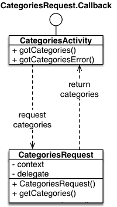

# Java Basics for Android
  In this section we will look at asynchronous code and interfaces. When building apps that require content from the internet, you often have to wait for requests to complete before things can continue. 
  
  
 Since code runs very fast, this often causes issues where the code has already continued running while the request is done yet. The callback is a principle that takes care of this issue. To implement callbacks into your apps, the interface functionality of the Java language is used. 

## Table of contents
- Asynchronous code - part 1
- Asynchronous code - part 2
- Callbacks
- Interfaces


### Asynchronous code - part 1

In the image above we first see a regular set of tasks that the computer executes sequentially. There is no problem when these things do not take extra time, like adding numbers together.

The second example shows us that task 3 is taking extra time to complete, because for example it performs a network request to download some information off the internet:


### Asynchronous code - part 2
If we wanted to keep everything one one thread, we would have to wait for it to complete before continuing, especially if some task at a later point in time is dependent on the information acquired during task 3. This renders the program unresponsive for the time it takes for 3 to complete, because no other tasks can be executed: progress has stalled. The last example shows us the effects of asynchronous code. 

While task 3 is started and still in progress, task 4, 5 and 6 are started in sequence, even though task 3 has not finished yet! This has different implications:

- It is faster, because tasks after task 3 do not have to wait for its completion if they are independent of it. Because of this the program is not unresponsive during the wait for 3.

- However, tasks that are dependent on task 3 cannot be called in sequence after starting task 3 (like in example 2), because there is no way of knowing whether task 3 has finished yet.


### Callbacks
Asynchronous code can greatly boost efficiency of things, but it adds a layer of difficulty as well, because you have to be aware of the duration of tasks and the dependency of other tasks on them. If task 4 were dependent on 3, then the third example it would fail, because task 4 is started before task 3 has acquired the appropriate data.

To benefit from continuing the regular program flow and still know when to call 4 as soon as task 3 is done, we can use a concept called the *callback*. A callback is used to inform the program that a certain task that was running has finished. 

In the last example, we would create a callback inside task 3, so that when it is finished, it can notify the other tasks that depend on it, like task 4. This allows tasks 5 and 6 to be executed without having to wait for 3 if there is time to do so, but prevents task 4 from failing because task 3 is not done yet. 

In this example, there is time to start and finish 5, but then the callback of 3 is triggered, signaling that 3 has finished and thus 4 can start. 4 is then run. 

Of course, in practice not everything happens on one thread like pictured here. Applications often utilize multiple threads so this example is greatly simplified. It just serves to illustrate the concept of a callback method and how it can be used to invoke methods that are dependent on another method that runs asynchronously. 


### Interfaces
When building your apps, code with different functionality is often spread over multiple files. Classes that take care of contacting an API or making another web request are not contained in the Activity, but have their own files. When a class in one of those files is working on a task that takes some time, we can of course wait until it is finished. 

If we stop all execution of code and wait, that works. However, this also means that the app will be unresponsive for the duration of that task. For this reason, Android Studio does not allow you to make network requests on the main thread, because that would mean the app freezes during these requests. It's not hard to imagine that using such an app would be very frustrating! 

When waiting for a response from the server or for some other task to finish, we need to have a way to communicate back to our activity that the task has finished. This becomes especially important with asynchronous code, because we cannot just continue running things in our Activity that are dependent on our network request, we might need to wait for the other class to finish what we are doing before we want anything to happen. 

  Imagine you want to show a list of movies obtained from IMDB in a ListView. You cannot do that until the network request downloading said list has finished. So any code that sets or updates the adapter needs to wait for the request and only fire once the request has completed succesfully and we have our list of data.

However, we don't want all our functionality to reside in the Activity, but separate in classes with each their own responsibility. This meanst that there needs to be a way to invoke a method in the Activity from inside some other class. In the example UML image there is an activity, `CategoriesActivity` that uses the helper class `CategoriesRequest` to perform a network request. Then, when this is done, depending on whether it was succesful or not, this class performs a callback. It invokes either `gotCategories()` (the data was retrieved) or `gotCategoriesError()` (something failed, like the internet stopped working or there was no response from the server). 

When the callback `gotCategories()` is performed, we can now be sure that the appropriate data is there and continue running code as necessary. To do this communication between Activity classes and other classes effectively, we can make use of the `interface` functionality of the Java programming language.


### Interface syntax

The declaration of an `interface` is somewhat similar to that of a class. Let's assume we want to define an interface called `Callback`. This would be the basic structure:

		public interface Callback {

		}

Inside the curly brackets we will define the methods that should be covered by it. In the example before we had defined `gotCategories()` and `gotCategoriesError()` as possible outcomes that should be handled by the interface. We want to use these methods to communicate from our helper class to the Activity class that our request was either succesful or failed. 

The actual implementation of the method is not done in the interface itself however, but left to the Activity, the place where we want to handle the result of our request. As such, the interface only contains the method *signature*: the return type, name and argument list.

		public interface Callback {
			public void gotCategories();
			public void gotCategoriesError();
		}

➡️ **Exercise 1.1:** *Inside `Callback.java`, write code that declares an interface with the method `taskFinished()` which takes no arguments and returns no value.*

As we can see the interface does not define what happens inside these methods. This is handled by the Activity. To make the connection between the Activity and the interface, we need to specify inside our Activity class declaration that it is connected to that specific interface. We make a promise, so to speak, that the Activity will handle the actual implementation of the method signatures defined in the interface.

		public class MainActivity implements Callback {
			...
		}

If we would try to compile this, it does not work. This is because the `implements` clause require us to at least add the empty method bodies to `MainActivity`:

		public class MainActivity implements Callback {
			...

			public void gotCategories() {
				// Here we can define what this method should do
			}

			public void gotCategoriesError() {
				// Here we can define what this method should do
			}
		} 

➡️ **Exercise 1.2:** *Inside `Activity.java`, make sure that the class implements the interface we just created and add the method body (without content for now) to the class.*

## Practice
For this exercise, we have provided you with a few Java files. Because we simulate the Android environment, we make use of an `Activity` class and a `Helper` class. The idea is that in your apps, you often want to keep network requests, database interactions or other time consuming tasks separate from the activities. The main method inside `InterfaceTest` initiates the `Activity` and the `Helper` class and then starts running the functionality inside the helper class: `new Thread(new Helper(a)).start();`

In this example, the Helper class performs a task `run()` that takes a bit of time, simulated by sleeping the thread for a few seconds. When this task is done, we want to notify your `Activity`, and this is where the interface comes into play. However, it has not been implemented yet!

### Exercises
 
 1. Add a method signature to the interface `Callback`.

 2. Make the `Activity` class implement this interface correctly. The method body can be a print statement of your choosing.

 3. Using the reference to the `Activity` 